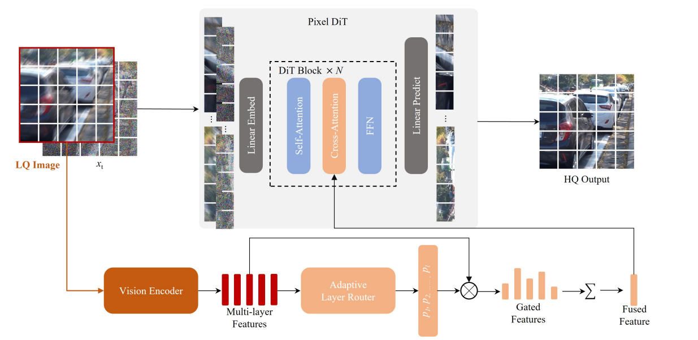
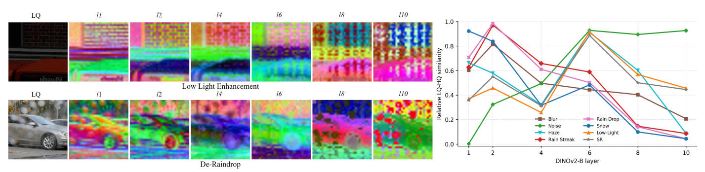

# PixRestore：像素空间扩散 Transformer 的统一图像修复

> **论文全名**：PixRestore: Unified Image Restoration via Pixel Diffusion Transformer
> **作者**：Lingchen Sun★, Rongyuan Wu★, Xiangtao Kong, Jixin Zhao, Qiaosi Yi, Yujing Sun, Shuaizheng Liu, Zhengqiang Zhang, Lei Zhang†
> **单位**：香港理工大学 Visual Computing Lab & OPPO 研究院
> **发表**：POLYU VCLAB Preprint 2026 / arXiv:2608.16793 (2026-08-17)
> **代码**：<https://github.com/csslc/PixRestore>

---

## 1. 一句话概括

PixRestore 用一个 **仅 ~50M 参数、纯像素空间、单步推理** 的 DiT（Diffusion Transformer），在 8 类退化的统一图像修复（UIR）任务上取得整体最优的保真度、感知质量与退化去除能力，同时比现有扩散类 UIR 方法快 7–1000× 以上，证明**强 UIR 模型并不必须依赖 VAE 或大规模 T2I 先验**。

---

## 2. 研究动机（Why）

统一图像修复 (Unified Image Restoration, UIR) 目标是用 **同一个模型** 处理去噪、去模糊、去雨、去雾、去雪、去雨滴、低光增强、超分等多种退化。当前主流做法可分两类，均有痛点：

| 路线 | 代表 | 主要痛点 |
| --- | --- | --- |
| 回归型（CNN/Transformer） | PromptIR、Restormer 等 | 依赖 L1/L2 损失，输出**过度平滑**、退化残留严重 |
| 生成型（基于 T2I 潜空间扩散） | Flux-IR、FAPE-IR、FoundIR-v2 等 | ① **VAE 压缩**会丢失小结构、笔画、边缘等修复敏感细节；② T2I 的开放式生成先验会引入**内容不一致的伪影**；③ 模型巨大、推理昂贵 |

作者提出的关键假设：**修复任务的输入本身就包含到目标输出的密集空间对应**——VAE 的有损压缩恰恰破坏了这种对应，应该被去掉。

---

## 3. 核心贡献（What）

1. **VAE-Free 像素空间 DiT**：直接在 RGB 像素上做 flow matching，通过 patchify（patch size = 8）把序列长度控制在可训练范围。
2. **自适应分层视觉先验 (Adaptive Hierarchical Visual Guidance)**：用冻结的 DINOv2 抽取多层特征，训练一个 **layer router** 基于 LQ–HQ 特征相似度预测每层可靠度：
   - 可靠层 → 融合作为 **条件**（cross-attention 注入）
   - 不可靠层 → 加强 **特征监督**（推动模型主动修复该层信息）
3. **DINO-based 对抗单步蒸馏**：将多步 flow 模型蒸馏为一步生成器，判别器直接在 DINO token 空间工作，几乎不引入额外开销。
4. **DR-Score (Degradation Removal Score)**：提出基于 VLM 的新评估指标，与人工偏好一致率高达 **90.7%**，弥补 MUSIQ/AFINE-NR 等 NR-IQA 无法反映"退化是否真被去掉"的缺陷。
5. **规模化验证**：提供 S/B/L/XL 四档模型，LPIPS 与 GFLOPs 的相关系数 −0.96，证明像素空间设计具有良好可扩展性。

---

## 4. 方法详解（How）

### 4.1 Pipeline 总览

### 4.2 像素空间 Flow Matching

- 线性插值路径：$x_t = (1-t)\,y_{hq} + t\,\epsilon$，$\epsilon \sim \mathcal{N}(0,I)$
- 模型直接预测清洁图像：$\hat y_{hq} = f_\theta([y_{lq}; x_t],\, t,\, \mathcal{F}(y_{lq}))$
- 速度损失：$\mathcal{L}_{flow}=\|\hat v_t - v_t\|_2^2$，其中 $v_t=(x_t-y_{hq})/t$（对 $1/t$ 在 0.05 处截断避免 $t \to 0$ 发散）
- DiT block：RMSNorm + QK-Norm Attention + RoPE，所有块共享同一 timestep block 产生 AdaLN 调制参数

### 4.3 像素 vs 潜空间对比（相同 DiT-S）

| Model | VAE | 参数量 | Inf VAE | PSNR ↑ | LPIPS ↓ | MUSIQ ↑ |
| --- | --- | ---:| ---:| ---:| ---:| ---:|
| Latent DiT-S | SD2VAE | 106.41 M | 78 ms | 22.10 | 0.2483 | 50.38 |
| Latent DiT-S | FluxVAE | 106.59 M | 78 ms | 22.63 | 0.2109 | 50.86 |
| Latent DiT-S | QwenVAE | 67.37 M | 41 ms | 22.80 | 0.2181 | 51.87 |
| **Pixel DiT-S** | **None (ps 8)** | **23.41 M** | **0 ms** | **26.62** | **0.1593** | **54.32** |

结论：**像素空间在所有指标上全面领先，同时参数量减半、无 VAE 延迟**。

### 4.4 为什么选择 DINOv2？——视觉先验对比与内部机理

不同 Visual Prior 对比：**统一 ViT-B、统一取第 11 层、统一 pixel DiT、统一数据与训练配方**，只替换冻结的视觉编码器：

| Visual Prior (ViT-B) | 预训练目标 | PSNR ↑ | SSIM ↑ | LPIPS ↓ | MUSIQ ↑ |
| --- | --- | ---:| ---:| ---:| ---:|
| CLIP-B | 图-文对比 | 26.61 | 0.8441 | 0.1598 | **54.30** |
| MAE-B | 像素级 mask 重建 | 26.70 | 0.8454 | 0.1593 | 54.20 |
| SigLIP-B | Sigmoid 图-文对比 | 26.66 | 0.8449 | 0.1592 | 54.19 |
| **DINOv2-B** | 自监督自蒸馏（全局+局部视图） | **27.25** | **0.8500** | **0.1531** | 54.21 |

DINOv2 在保真 & 感知的综合平衡上明显最优。作者给出的解释可归纳成 **"UIR 需要的两种属性 DINO 恰好都有"**：

| UIR 需要什么 | DINOv2 为何满足 | 其它候选为何欠缺 |
| --- | --- | --- |
| **空间稠密、位置精确的 token**——才能重建像素级细节、纹理、边缘 | DINO 自蒸馏在 global crop 与 local crop 之间对齐，天然要求 token 保留局部结构 | CLIP/SigLIP 对齐文本，只需要全局语义，稠密 token 已被"平均化" |
| **语义可判别性**——才能把"内容"和"退化"区分开 | DINOv2 的自蒸馏 objective 让 [CLS]/patch token 均高度线性可分（NN 分类基线达到 SOTA） | MAE 的重建目标偏低层像素，token 语义判别力弱 |
| **零文本依赖**——修复任务里 caption 通常没有 | 纯视觉自监督，不需要 text prompt | CLIP/SigLIP 依赖 caption 对齐，把细节压缩掉了 |

一句话：**"DINO token 同时是像素邻居的精确探针，又是语义类别的判别子"**——这正是既要"忠实还原"又要"识别并去除退化"的 UIR 所需要的双重能力。

作者把 DINOv2 的 12 层特征分别可视化，发现：

- **浅层 $l_1$–$l_2$**：几乎就是边缘/纹理图，对**去雨条纹、去模糊、去雪**最敏感（这类退化正是"结构级"破坏）
- **中层 $l_5$–$l_7$**：对**低光增强、超分、去雾**最敏感（依赖局部对比度和中层语义）
- **深层 $l_8$–$l_{10}$**：编码全局语义，对**噪声**最敏感（因为噪声破坏的是语义可读性，浅层反而"被骗过"）

这也就直接解释了后面为什么必须做 **每张图片自适应的分层加权**，而不能像 SD-based UIR 那样固定用某一层。

### 4.5 自适应分层视觉指引（Adaptive Hierarchical Visual Guidance）

设从 DINOv2 抽取一组层 $\mathcal{L}=\{l_1,\dots,l_{|\mathcal{L}|}\}$，每层特征投影后得到 $U_l$。整个模块解决两件事：**（i）怎么把多层特征合成条件？（ii）怎么让主干"补齐"它自己没学好的那些层？**

#### 4.5.1 关键量：LQ–HQ 层相似度 $s_l$ 的精确定义

对每一层 $l$，从投影后的 patch token 序列 $U_l^{lq}, U_l^{hq}\in\mathbb{R}^{N\times d}$（$N$ = patch 数，$d$ = 投影维度）算两种相似度并取平均：

$$
s_l = \frac{1}{2}\left(s_l^{\cos} + s_l^{\text{dist}}\right)
$$

其中包含两个分量。

**（1）余弦相似度分量**（衡量方向一致性，即语义/结构对齐）：

$$
s_l^{\cos} = \frac{1}{N}\sum_{n=1}^{N}\frac{\langle U_l^{lq}[n],\; U_l^{hq}[n]\rangle}{\|U_l^{lq}[n]\|_2\;\|U_l^{hq}[n]\|_2}
$$

**（2）归一化 $L_2$ 距离相似度分量**（衡量幅值差距，把距离映射回 $[0,1]$ 的相似度）：

$$
s_l^{\text{dist}} = \frac{1}{N}\sum_{n=1}^{N}\left(1-\tilde d_l[n]\right), \quad \tilde d_l[n] = \frac{\|U_l^{lq}[n]-U_l^{hq}[n]\|_2}{Z_l}
$$

**为什么两种相似度都要**？两者互补：

- 余弦对**方向**敏感，能捕捉"内容语义还在不在"；但对整体幅值缩放不敏感（低光图会被误判为"和 GT 完全一致"）；
- $L_2$ 距离对**幅值/强度**敏感，能捕捉"亮度/对比度是否被破坏"；但对高维方向漂移不够灵敏。
- 加权平均 $\frac{1}{2}(\cdot+\cdot)$ 让 $s_l$ 同时反映**语义对齐**与**能量对齐**。

**含义**：$s_l \uparrow$ ⇒ 该层 LQ 特征已经很像 HQ ⇒ 说明这层"没被这种退化太伤到" ⇒ **可靠**，可以拿来做条件；$s_l \downarrow$ ⇒ 该层特征被破坏严重 ⇒ **不可靠**，主干需要"努力补它"。

> ⚠️ **注意**：$s_l$ 只在**训练时**可算（需要 HQ）。推理时用轻量 router $\rho_\psi$ 从 LQ 直接预测权重 $p_l$。

#### 4.5.2 两组互补权重：$q_l$（条件端）与 $r_l$（监督端）

同一个 $s_l$ 被用来产生**方向相反**的两个 softmax 分布：

**条件权重 $q_l$**（相似度越高，权重越大）——用于把多层特征 fuse 成条件 $U_{fuse}=\sum_l p_l U_l$，注入 DiT 做 cross-attn 的 K/V：

$$
q_l = \frac{\exp(s_l)}{\sum_{k\in\mathcal{L}}\exp(s_k)}
$$

**监督权重 $r_l$**（相似度越低，权重越大）——用于给不可靠层加更大 loss $\mathcal{L}_{feat}=\sum_l r_l\,\ell^{feat}_l$：

$$
r_l = \frac{\exp(1-s_l)}{\sum_{k\in\mathcal{L}}\exp(1-s_k)}
$$

$q_l$ 与 $r_l$ 在 softmax 前的输入**互为反号**，构成"**你会的我拿来用；你不会的我使劲练你**"的分工。作者的原话是：*"$q_l$ selects reliable content features for conditioning, while $r_l$ focuses supervision on layers that need stronger restoration."*

其中特征监督逐层损失为**余弦相似度损失**（同一 DINO 层）：

$$
\ell^{feat}_l \;=\; 1 - \frac{1}{N}\sum_n \frac{\langle F_l(\hat y_{hq})[n],\; F_l(y_{hq})[n]\rangle}{\|F_l(\hat y_{hq})[n]\|_2\;\|F_l(y_{hq})[n]\|_2}
$$

#### 4.5.3 推理时的 router $\rho_\psi$

$\rho_\psi$ 是一个轻量 MLP，输入是**LQ 图**与**投影后的多层 LQ 特征**的拼接 $[y_{lq}, U_l]$，输出 $|\mathcal{L}|$ 维 logits 再 softmax 得 $p_l$：

$$
p_l = \text{softmax}\left(\rho_\psi([y_{lq}, U_l])\right),\quad l\in\mathcal{L}
$$

训练时用交叉熵向 $q_l$ 蒸馏：

$$
\mathcal{L}_{wpred} \;=\; -\sum_{l\in\mathcal{L}} q_l\,\log p_l
$$

推理时 HQ 不可得，就直接用 $p_l$ 替代 $q_l$ 做融合。

#### 4.5.4 多步阶段总损失

$$
\mathcal{L} \;=\; \mathcal{L}_{flow} \;+\; 0.5\,\mathcal{L}_{wpred} \;+\; 0.5\,\mathcal{L}_{feat}
$$

所有层特征在投影前统一做 **channel-wise RMS 归一化**，防止不同层激活尺度差异让 $s_l$ 失真。

### 4.6 单步蒸馏

- 学生模型固定 $t=1$，从纯噪声一步预测清洁图：$\hat y_{hq}=f_\theta([y_{lq};\epsilon],\,1,\,\mathcal{F}(y_{lq}))$
- 在同一 DINO 特征上加轻量多层判别器 $D_l$，判别 HQ 与恢复图特征真伪：
  - $\mathcal{L}_D = \frac{1}{|L|}\sum_l[\ell_{bce}(D_l(F^{y_{hq}}_l),1)+\ell_{bce}(D_l(F^{\hat y_{hq}}_l),0)]$
  - $\mathcal{L}_{adv} = \frac{1}{|L|}\sum_l \ell_{bce}(D_l(F^{\hat y_{hq}}_l),1)$
- 完整目标：$\mathcal{L}=\mathcal{L}_{flow}+0.5(\mathcal{L}_{wpred}+\mathcal{L}_{feat}+\mathcal{L}_{adv})$

### 4.7 DR-Score：基于 VLM 的退化去除评估指标

**动机**：真实世界无 GT，FR 指标（PSNR/LPIPS）失效；NR-IQA（MUSIQ/AFINE-NR）只看"清不清晰"，不看"退化是否被去掉"。Fig. 4 的极端例子：**MUSIQ 甚至给"仍带雨条纹"的 FoundIR-v2 打得比 PixRestore 更高**——图像质量 ≠ 任务完成度。DR-Score 就是补上后者，作为**辅助诊断**（不替代 PSNR/LPIPS）。

**评测协议**：用 **Gemini 3.1 Pro** 作为评判者，输入 `(LQ 图, 复原图, 任务类型 + 目标简述)`，输出 `(task type, score∈[0,100], 一句话原因)`。0 = 退化完全没去掉，100 = 干净彻底去除。每个任务都有专属评分准则（如 deblur 判"模糊是否去除+细节是否锐利"；SR 判"细节是否恢复+**无**过度平滑/伪影"）。**输出解释**让指标可解释，是传统 IQA 做不到的。

**稳定性**：VLM 输出有随机性，每图查 **5 次求均值**。附录 D 给出两个 std：

- **Run-level std（方法均分）= 0.10–0.43** → 方法级排名极稳
- **Image-level std（单图）= 5.3–6.4** → 单图会飘但不影响排名

**人工一致率 = 90.7% 的来源**：pairwise human study——**6 类真实退化 × 20 组 = 120 pairs**，从 {DA-CLIP\*, FoundIR\*, FoundIR-v2\*, FAPE-IR\*, PixRestore} 里随机抽 2 个双盲对比，**20 位标注者**关注"退化是否去除 / 内容是否保留 / 伪影是否抑制"三点。"aligned" = 人偏爱 A 且指标也给 A 更高分。结果 DR-Score 一致率 **90.7%**，显著高于 MUSIQ / AFINE-NR / TOPIQ / MANIQA。

**失败模式**：两个结果**视觉几乎相同、只差微妙亮度/对比度/色调**时，DR-Score 会不稳（连人工都要细看）——它适合**"退化明显去/没去"的粗粒度诊断**，不适合"两个好结果挑更精致"。

---

## 5. 模型变体

| 变体 | Backbone | Hidden | Blocks | Heads | Vision Enc |
| --- | --- | ---:| ---:| ---:| --- |
| PixRestore-S | LightningDiT-S | 384 | 12 | 6 | DINOv2-S |
| PixRestore-B | LightningDiT-B | 768 | 12 | 12 | DINOv2-B |
| PixRestore-L | LightningDiT-L | 1024 | 24 | 16 | DINOv2-L |
| PixRestore-XL | LightningDiT-XL | 1152 | 28 | 16 | DINOv2-L |

所有变体统一 patch size = 8，DINO 编码器全程冻结。

---

## 6. 训练与评估设置

- **训练语料**：~2.83M 图像，覆盖 8 类退化任务，等概率采样
- **优化**：AdamW，lr = 1e-4，bs = 16，512×512 crop，8× NVIDIA A800
- **训练步数**：多步模型 250K iter → 单步蒸馏 100K iter
- **评估基准**：15 个公开数据集（GoPro、UHD-blur、RESIDE-6K、DIV2K、PolyU、RainDS-real、UHD-LL、LOL、WeatherBench、RealSR、ScreenSR 等）+ 无 GT 的真实世界测试集（每种退化 100 张）
- **指标**：PSNR / SSIM（保真）、LPIPS / DISTS（感知）、MUSIQ / AFINE-NR（无参考）、**DR-Score（基于 Gemini 3.1 Pro 的 VLM 退化去除评分，详见 § 4.7）**

---

## 7. 主要实验结果

### 7.1 公开基准（部分节选，↑越高越好，↓越低越好）

| Method | 平均 PSNR ↑ | 平均 LPIPS ↓ | 平均 DR-Score ↑ | 参数量 |
| --- | ---:| ---:| ---:| ---:|
| PromptIR* | ~28 | ~0.19 | ~64 | — |
| DA-CLIP* | ~27 | ~0.13 | ~72 | — |
| FoundIR-v2* | ~26 | ~0.19 | ~74 | 大 |
| Flux-IR* | ~22 | ~0.32 | ~55 | 极大 |
| FAPE-IR* | 高 | 低 | ~78 | 极大 |
| **PixRestore-S** | **强** | **最优** | **~78** | **53.7 M** |
| **PixRestore-B** | **最优** | **最优** | **~80** | **210.9 M** |

在 de-raindrop、denoise、desnow 等多任务上，PixRestore/PixRestore-B 都取得或接近最佳 LPIPS、DISTS 与 DR-Score。

### 7.2 模型复杂度（Table 3）

| 方法 | 参数量 | GFLOPs | 单张延迟 |
| --- | ---:| ---:| ---:|
| Flux-IR | 巨大 | ~795k | ~1s+ |
| FoundIR-v2 | 大 | ~119k | ~1s |
| FAPE-IR | 大 | 高 | ~300+ ms |
| **PixRestore** | **53.7 M** | **658** | **44 ms** |
| **PixRestore-B** | **210.9 M** | **1842** | **79 ms** |

**结论**：GFLOPs 仅为 FoundIR-v2 的 **1/181**、Flux-IR 的 **1/1209**，推理速度快 7–23×，且质量还更好。

### 7.3 消融实验（Table 4 摘要）

| ID | 变体 | NFE | Cond | Sup | PSNR | LPIPS | MUSIQ |
| --- | --- | ---:| --- | --- | ---:| ---:| ---:|
| A0 | Pixel DiT-S baseline | 10 | – | – | 26.62 | 0.1593 | 54.32 |
| A2 | + 单层条件 (layer 5) | 10 | L5 | – | 27.36 | 0.1489 | 54.64 |
| A5 | + 多层均匀条件 | 10 | Avg 6 | – | 27.72 | 0.1407 | 55.01 |
| A6 | + 均匀分层监督 | 10 | Avg 6 | Avg 6 | 27.36 | 0.1239 | 54.59 |
| **A7** | **+ 自适应分层视觉指引** | 10 | **Adap 6** | **Adap 6** | **27.66** | **0.1209** | **54.97** |
| A8 | 同上，减到 4 步 | 4 | Adap 6 | Adap 6 | 27.75 | 0.1228 | 54.07 |

- 加入 DINO 条件立即涨点；自适应比均匀融合显著改善感知质量（LPIPS 0.1407 → 0.1209）。
- Table S.4 中 DINOv2-B > CLIP/MAE/SigLIP，验证 DINOv2 是最佳视觉先验。

### 7.4 真实世界泛化 & DR-Score

- 在真实世界数据集（无 GT）上，**PixRestore-B 取得最高平均 DR-Score (67.88)**，超越 FAPE-IR\* (67.55)、FoundIR-v2\*。
- 传统 NR-IQA（MUSIQ / AFINE-NR）常与人工判断不一致（Fig. 4：MUSIQ 反而偏爱**仍带雨条纹**的输入），而 **DR-Score 与人工偏好一致率 90.7%**（详见 § 4.7 关于协议、稳定性与人工研究的完整解释）。
- 用 DR-Score 复评所有 baseline 后，**结论从"MUSIQ 打得高不等于修复得好"变成"是否真的完成了去退化任务"** —— 这也是本文能证明 PixRestore 在真实数据上"整体最优"的关键。

### 7.5 可扩展性

- 变小 patch（4）或增大 backbone（S→XL），LPIPS 平滑下降，与 GFLOPs 呈相关系数 −0.96 的线性关系；表明 PixRestore 沿两条轴均可扩展。

---

## 8. 局限性

1. **固定分辨率**：DiT + 固定 patchify 导致一次训练后**难以直接推广到更高分辨率**，需重训或改结构。
2. **极端退化**：相对十亿级 T2I 模型，紧凑主干在信息极度缺失场景下能力有限。
3. **DR-Score 依赖闭源 VLM**：随模型更新可能有波动；对亮度/对比度差异微小的对比不够敏感。

---

## 9. 亮点洞察 & 启示

- **像素空间 ≠ 一定更贵**：在 UIR 中，由于 patchify 可控 token 长度且省去 VAE，像素空间反而**更小、更快、更准**。
- **修复本质是"条件密集对齐"**：任何有损压缩都会伤害修复；生成先验应服务于修复而非主导。
- **分层特征的用法**：对可靠层做条件、对不可靠层做监督——**"用你会的、练你不会的"**，是一个通用的先验利用思路，可迁移到其他底层视觉任务。
- **VLM-as-Metric**：DR-Score 展示了 VLM 作为可解释、任务感知度量的潜力，可能推动 IQA 领域范式转变。
- **单步扩散 + 判别器蒸馏**：判别器建在冻结 DINO token 上，几乎零成本地补回单步生成缺失的纹理细节。
